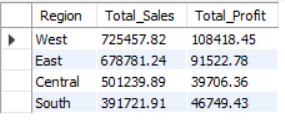
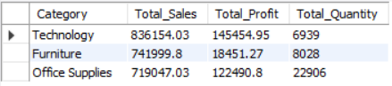
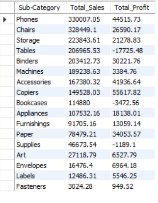
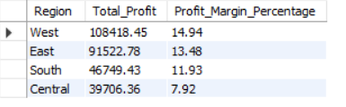
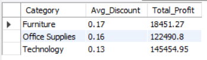

# SQL E-commerce Analysis

## Project Overview

This project analyzes e-commerce sales data using SQL to identify revenue drivers, profitable categories, regional performance, and discount impacts.

## Tools Used

- MySQL
- SQL
- GitHub

## Dataset

Sample Superstore Dataset

## Key KPIs

- Total Sales: 2,297,200.86
- Total Profit: 286,397.02
- Total Quantity Sold: 37,873

## Key Insights

### Regional Analysis

- West region generated the highest sales and profit.
- Central region had the lowest profit margin (7.92%).

### Category Analysis

- Technology was the highest-performing category.
- Furniture generated high revenue but low profitability.

### Sub-Category Analysis

- Phones generated the highest sales.
- Copiers generated the highest profit.
- Tables were the largest loss-making sub-category.

### Discount Analysis

- Furniture received the highest average discount.
- High discounting may be reducing profitability.

## Business Recommendations

- Increase focus on Technology products.
- Review Furniture pricing strategy.
- Investigate losses from Tables and Bookcases.
- Improve profitability in the Central region.

## Author

Simran Sonawane

LinkedIn: www.linkedin.com/in/simran-sonawane24

GitHub: https://github.com/simransonawane24

## Project Screenshots

### KPI Dashboard

### Regional Analysis

### Category Analysis

### Sub-Category Analysis

### Profit Margin Analysis

### Discount Analysis

## Business Questions

1. Which region generates the highest sales?
2. Which category is the most profitable?
3. Which sub-categories are causing losses?
4. How do discounts affect profitability?
5. Which region has the best profit margin?

## SQL Skills Demonstrated

- Aggregate Functions
- GROUP BY
- ORDER BY
- Business KPI Analysis
- Profit Margin Calculation
- Data Aggregation
